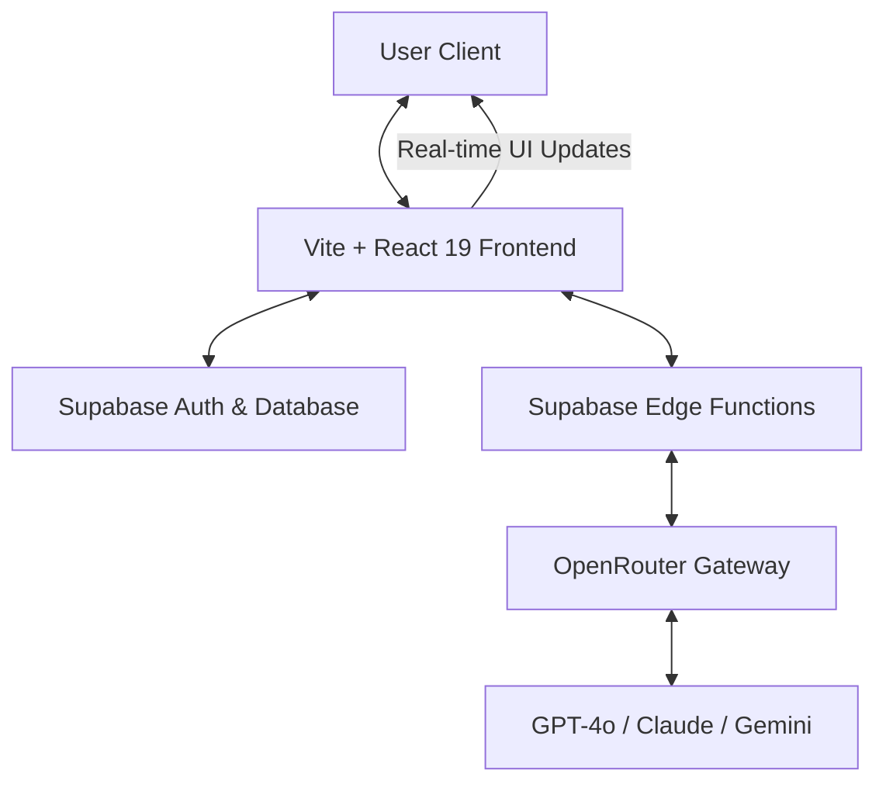

# 🐼 Panda AI — Premium Full-Stack AI Companion

> A state-of-the-art, recruiter-ready AI assistant web application featuring a multi-model architecture, persistent memory, and a high-performance UI.

---

## 🌟 Project Overview

**Panda AI** is a professional-grade full-stack AI web application designed to deliver a seamless, high-performance chat experience. Built with a focus on modular architecture and scalability, it leverages modern technologies like React 19, Supabase, and OpenRouter to provide users with a reliable and intelligent digital companion.

Unlike standard tutorial projects, Panda AI is engineered for production, featuring secure authentication, persistent state management across sessions, and a "Rose Romance" design system that prioritizes aesthetic excellence and user engagement.

## 🚀 Live Highlights & Key Features

- **Multi-Model Intelligence**: Dynamically switch between top-tier models including GPT-4o, Claude 3.5 Sonnet, and Gemini 1.5 Flash via OpenRouter.
- **Persistent Memory**: Full chat history persistence powered by Supabase, ensuring your conversations are always available.
- **Secure Authentication**: Robust user management using Supabase Auth, supporting both email/password and social login providers.
- **Micro-Animation Engine**: Engaging UI with floating particles and smooth transitions for a premium, "living" interface feel.
- **Responsive "Liquid" Design**: Fully optimized for mobile, tablet, and desktop with a focus on accessibility and performance.
- **Bilingual Core**: Native support for English and Hindi (bilingual system prompts and UI).

---

## 🏗️ System Architecture

Panda AI follows a clean "Data-Fluid" architecture, ensuring low latency and high reliability between the client and AI layers.



### Detailed Architecture Breakdown

#### 🎨 Frontend Responsibilities
- **State Management**: React hooks for local state and session persistence.
- **UI/UX**: Tailwind CSS for high-performance styling and custom micro-animations.
- **Service Layer**: Decoupled API service for AI interactions with built-in exponential backoff for rate limiting.

#### ⚙️ Backend Responsibilities (Supabase)
- **Edge Functions**: Secure proxying of AI requests to protect API keys and handle business logic.
- **Database**: PostgreSQL schema designed for high-concurrency chat sessions and user profiles.
- **Real-time Engine**: Sycing state across multiple devices and browser sessions.

#### 🧠 AI Integration Layer
- **OpenRouter Abstraction**: A unified interface to interact with multiple LLMs without refactoring frontend code.
- **System Orchestration**: Language-aware system prompts that maintain persona consistency.

---

## 🛠️ Technology Stack

### 💻 Frontend
- **Framework**: React 19 (Latest)
- **Tooling**: Vite (Fast HMR)
- **Language**: TypeScript
- **Styling**: Tailwind CSS & CSS Modules

### ⚙️ Backend & Infrastructure
- **Serverless**: Supabase Edge Functions
- **Database**: PostgreSQL (via Supabase)
- **Auth**: Supabase Auth (JWT based)
- **Hosting**: Vercel

### 🧠 Intelligence Layer
- **OpenRouter Integration**: Access to GPT-4o, Claude 3.5, and Gemini 1.5 Pro/Flash.

---

## 📁 Folder Structure

```text
Panda-AI/
├── components/          # Reusable UI components (Auth, Sidebar, Chat)
├── services/            # API integration and environment validation logic
├── types/               # Global TypeScript definitions
├── constants/           # Multi-language translations and theme configs
├── supabase/            # Edge functions and migration scripts
├── public/              # Static assets and icons
├── App.tsx              # Root application container & routing
└── README.md            # Comprehensive project documentation
```

---

## 💻 Local Development Setup

Follow these steps to get a local instance of Panda AI running on your machine:

### 1. Clone the Repository
```bash
git clone https://github.com/your-username/panda-ai.git
cd panda-ai
```

### 2. Install Dependencies
```bash
npm install
```

### 3. Environment Configuration
Create a `.env.local` file in the root directory and add the following:

```env
# AI Service Key (OpenRouter)
VITE_OPENROUTER_API_KEY=your_openrouter_key_here

# Supabase Configuration
VITE_SUPABASE_URL=your_supabase_project_url
VITE_SUPABASE_ANON_KEY=your_supabase_anon_key
```

### 4. Start Development Server
```bash
npm run dev
```

---

## 🌐 Production Deployment (Vercel)

Panda AI is designed for effortless deployment on **Vercel**:

1. Connect your GitHub repository to Vercel.
2. In the Vercel dashboard, go to **Settings > Environment Variables**.
3. Import the variables from your `.env.local`.
4. Run `npm run build` to verify the production bundle.
5. Deploy!

---

## 🗺️ Future Roadmap

- [ ] **Voice Integration**: Hands-free AI interactions with Whisper & TTS.
- [ ] **Artifacts System**: Code sandboxes and document previews within chat.
- [ ] **Collaborative Sessions**: Share chat links with other users in real-time.
- [ ] **Model Marketplace**: Allow users to select their preferred AI provider.

---

## 👨‍💻 About the Developer

**Alakh Niranjan**
**Alakh **
*Full-Stack Engineer & AI Enthusiast*

Dedicated to building intelligent products that bridge the gap between complex AI systems and intuitive user experiences.

---

## 📄 License

This project is licensed under the **MIT License**. Feel free to use it as a foundation for your own AI applications.
